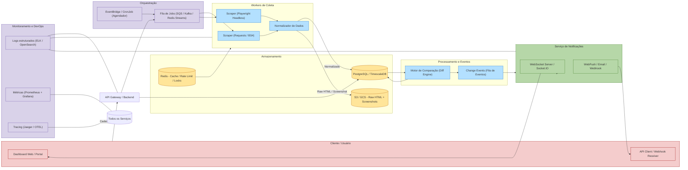

Excelente! 💡
Aqui está o **diagrama de arquitetura em Mermaid** mostrando o fluxo completo da solução da **Obsrv** — da coleta dos dados (scraping) até o envio de notificações e disponibilização via API/dashboard.

Você pode copiar este bloco diretamente em um README.md ou em ferramentas como o [Mermaid Live Editor](https://mermaid.live/) para visualizar graficamente.

---

---

## 🧭 Interpretação rápida

* **Scheduler** → agenda tarefas diárias (via EventBridge/CronJob) e coloca jobs na **fila**.
* **ScraperCluster** → executa scrapers (HTTP simples ou headless) e envia resultados normalizados ao **storage**.
* **Storage** → guarda JSON normalizado (Postgres) + HTML/screenshot bruto (S3).
* **Diff Engine** → compara snapshots e gera eventos de mudança.
* **Notification Service** → envia notificações em tempo real (WebSocket, WebPush, Webhook).
* **Observability** → centraliza logs, métricas e tracing.
* **Client** → consome tudo via Dashboard ou integrações.

---

Quer que eu adicione **ícones específicos de provedores (AWS, GCP, Azure)** ou uma **versão separada por domínio (coleta / processamento / entrega)**?
Posso gerar uma variante visual “AWS architecture style” em Mermaid também.
